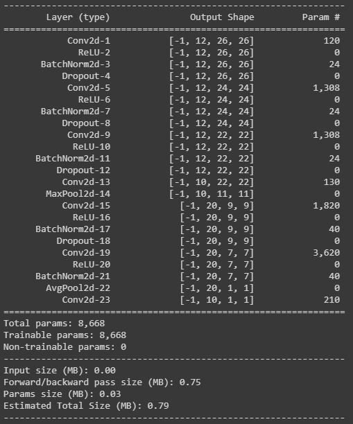
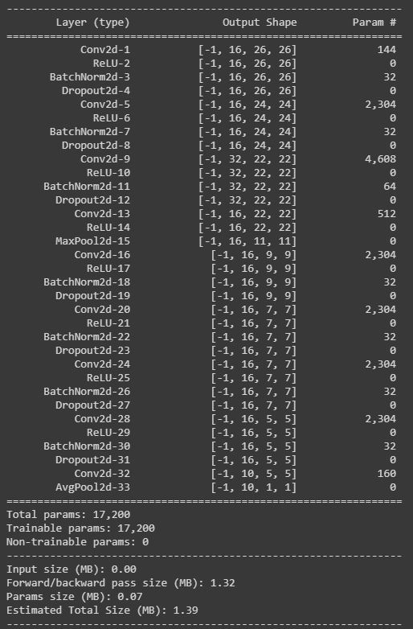

<h1 align="center">Architecture Basics</h1>

<h2 align="center">Question</h2>

We have considered many many points in our last 4 lectures. Some of these we have covered directly and some indirectly. They are:
* How many layers,
* MaxPooling,
* 1x1 Convolutions,
* 3x3 Convolutions,
* Receptive Field,
* SoftMax,
* Learning Rate,
* Kernels and how do we decide the number of kernels?
* Batch Normalization,
* Image Normalization,
* Position of MaxPooling,
* Concept of Transition Layers,
* Position of Transition Layer,
* DropOut
 * When do we introduce DropOut, or when do we know we have some overfitting
* The distance of MaxPooling from Prediction,
* The distance of Batch Normalization from Prediction,
* When do we stop convolutions and go ahead with a larger kernel or some other alternative (which we have not yet covered)
* How do we know our network is not going well, comparatively, very early
* Batch Size, and effects of batch size
* etc (you can add more if we missed it here)

Refer to this code: [COLAB](https://colab.research.google.com/drive/1uJZvJdi5VprOQHROtJIHy0mnY2afjNlx)

WRITE IT AGAIN SUCH THAT IT ACHIEVES:
* 99.4% validation accuracy
* Less than 20k Parameters
* You can use anything from above you want. 
* Less than 20 Epochs
* No fully connected layer
* To learn how to add different things we covered in this session, you can refer to this code: [Kaggle](https://www.kaggle.com/enwei26/mnist-digits-pytorch-cnn-99) DONT COPY ARCHITECTURE, JUST LEARN HOW TO INTEGRATE THINGS LIKE DROPOUT, BATCHNORM, ETC.

**Note:** This is a slightly time-consuming assignment, please make sure you start early. You are going to spend a lot of effort into running the programs multiple times
Once you are done, submit your results in S4-Assignment-Solution
You must upload your assignment to a public GitHub Repository. Create a folder called S4 in it, and add your iPynb code in it. THE LOGS MUST BE VISIBLE. Before adding the link to the submission make sure you have opened the file in an "incognito" window. 
If you misrepresent your answers, you will be awarded -100% of the score.
If you submit Colab Link instead of notebook uploaded on GitHub, or redirect the GitHub page to colab, you will be awarded -50%
This assignment is worth 300pts

<h2 align="center">Solution and Results</h2>

I developed two Architecture, the first one was very amibitious, I wanted to develop an architecture which could reach 99.4 % accuracy in **less than 10k Parameters without LR Scheduling and Image Augmentation**, I developed a decent model but it it was not able to cross 99.1, On doing some analysis I found out that my receptive field was less, it was 18x18 and had to be increased and also my training accuracy was not crossing 99.4 so the model parameters were also to be increased. This is when model 2 emerged.

## Model 1

### Architecture

  

Here I have created 4 blocks i.e. 2 x Convolution Block, 1 X Transition Block and Global Average Pooling block. Each Convolution Block has a convolution layer, ReLU activation function, Batch Normalization layer and Dropout layer. Each Transition block has a point wise convolution layer followed by Max Pooling layer. The Global Average pooling block has an Average Pool 2d Layer followed by pointwise convolution layer. Here I have used Dropout of 0.05. Here all the kernels used are of size 3x3. The batch size is 128 and SGD is used as an optimizer with default settings. 

#### Observations

The reason to have only 1 transition block is because of the size of the dataset, the image is very small and we dont two max pooling layers for such small dataset as it will force in losing some values. 

The model is learning slow, The model is not able to cross 99.3 % training accuracy , testing is around 99.1 %. The receptive field of the model is 18x18 forcing the model to look at a partial image and take a decision. Here, this can be improved, resulting in an increase in accuracy as much data will then be look to make results. The model build is pretty good as without any augmentation or LR scheduling the model is able to reach 99.1 % validation accuracy. 

## Model 2

### Architecture

  

So based on the observations of the previous model, I was able to decide that I need to increase my receptive field and need some more parameters as we are bounded by the no Augmentation and No LR scehduling constraint. Hence after some tweeking I chose the above architecture which performs really well, it gives a validation accuracy of 99.5% in 17200 paramters with dropout value set to 0.1 and default SGD optimizer

## Results

### Model 1

Total Parameters = 8668

Best Training Accuracy = 99.26%

Best Testing Accuracy = 99.05%

Dropout = 0.05

**Observations**:
* Overfitting
* Less parameters
* Less receptive field

### Model 2

Total Parameters = 17200

Best Training Accuracy = 98.72%

Best Testing Accuracy = 99.50%

Dropout = 0.1

**Observations**:
* Underfitting (going to hard on the training)
* Great Validaiton accuracy.

---
<h3 align="center">Made with ❤ by KillerStrike</h3>
