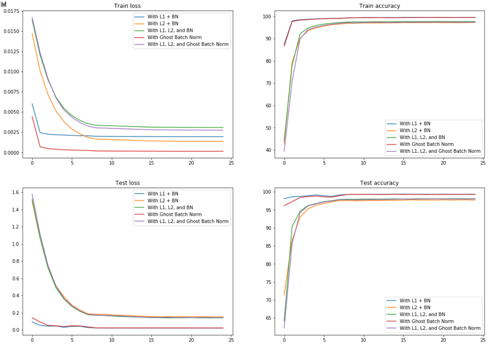
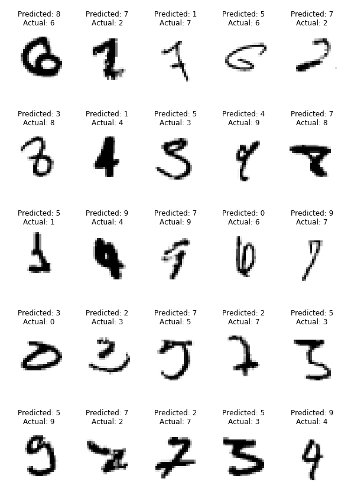

<h1 align = "center">Batch Normalization and Regularization Assignment</h1>

<h2 align = "center">Assignment</h2>

Your assignment 7 will demand these things:

1. Change your code in such a way that all of these are in their respective files:
    1. model
    2. training code
    3. testing code
    4. regularization techniques (dropout, L1, L2, etc)
    5. dataloader/transformations/image-augmentations
    6. misc items like finding misclassified images
2. So, while doing assignment 6, please think how would you be able to do this in the next assignment
 

GBN Note: read the paper. Please make sure you are not using the same batch size for BN and GBN jobs below. 

1. Your assignment 6 is to take your best 5th code, and run bellow versions for 25 epochs and report findings:
    1. with L1 + BN
    2. with L2 + BN
    3. with L1 and L2 with BN
    4. with GBN
    5. with L1 and L2 with GBN
2. You cannot be running your code 5 times manually (-500 points for that). You need to be smarter and write a single loop or iterator to iterate through these conditions.
3. draw ONE graph to show the validation accuracy curves for all 5 jobs above. This graph must have proper legends and it should be clear what we are looking at.
4. draw ONE graph to show the loss change curves for all 5 jobs above. This graph must have proper legends and it should be clear what we are looking at.
5. find any 25 misclassified images (combined into single image) for "with GBN" model. You should be using the saved model from the above jobs.  You MUST show the actual and predicted class names.
6. the explanatory README file that explains what is your code all about, your findings, and your single image showing 25 misclassified images.
7. submit the Github link
 

 

Here are some of the questions for S6-Assignment-Solution:

1. Upload the Validation Accuracy Change Graph (all 5 models combined) - 100 pts
2. Upload the Loss Change Graph (all 5 models combined) - 100 pts
3. Upload the image showing 25 misclassified images for the "with GBN" model. - 250 pts
4. Explain your observation w.r.t. L1 and L2's performance in the regularization of your model. - 50 pt

<h2 align = "center">Solution and Results</h2>

In this assignment, we had to take the best model from the previous assignment and run 5 experiments on it. These experiments were about trying out L1 and L2 loss, as well as ghost batch normalization technique.
### Experiments

#### Experiment 1
This experiment involved testing the model with L1 loss and good old batch normalization. 
- optimizer: SGD with `lr`=0.01, `momentum`=0.9
- scheduler: StepLR with `step size`=8 and `gamma`=0.1
- `l1 lambda`=5e-4

The test and train loss quickly reduces when L1 regularization is applied. moreover, the train and test accuracy of the model quickly rises when compared to L2 regularization. The difference between the train accuracy and test accuracy is around ~0.25

#### Experiment 2
This experiment involved testing the model with L2 regularization and batch normalization
- optimizer: Adam with `lr`=1e-4 and `weight decay`=1e-5
- scheduler: StepLP with `step size`=8 and `gamma`=0.1
- loss function: negative log likely hood

The test and train loss doesn't seem to reduce as quickly as with L1 regularization, and the accuracy doesn't rise up that quickly, but it looks like the effect of regularization is a lot more prominent in L2 regularization, with the difference between train and test accuracy in the later epochs being around ~0.6, with the model leaning towards underfitting, which is good in some ways.

#### Experiment 3
This experiment involved testing the model with both L1 and L2 regularization, and batch normalization.
- optimizer: Adam with `lr`=1e-4 and `weight decay`=1e-5
- scheduler: StepLP with `step size`=8 and `gamma`=0.1
- `l1 lambda`=5e-4

This experiment's results looks similar to that of experiment 2, with L2 regularization's effect being more prominent than L1. This could be fixed by increasing `l1 lambda` to give more weightage to L1 regularization, but for the purposes of a fair comparison, the `l1 lambda` value is kept constant throughout all the experiments.

#### Experiment 4
This experiment involved testing the model with only ghost batch normalization
- optimizer: SGD with `lr`=0.01, `momentum`=0.9
- scheduler: StepLP with `step size`=8 and `gamma`=0.1
- number of splits: 2

Ghost batch normalization vastly out performs both L1 regularization and L2 regularization. Not only does the model train quickly, the accuracy achieved is much higher than any of the other experiments. Ghost batch normalization FTW! :raised_hands:

#### Experiment 5
This experiment involved testing the model with both L1 and L2 regularization, along with Ghost Batch Normalization.
- optimizer: Adam with `lr`=1e-4 and `weight decay`=1e-5
- scheduler: StepLP with `step size`=8 and `gamma`=0.1
- `l1 lambda`=5e-4

Performance falls drastically when compared to experiment 4. The difference between the train and test accuracy is around ~0.64. This experiment performs just a bit better than experiment 3. Looks like choosing a good hyperparameter value for the L1 regularization weight is important. Also, it looks like too many cooks spoil the broth.

### Plots and Images
Here's the plot for the loss and accuracies for train and test phases:

And here's 25 misclassified images from experiment 4:

### Appendix
The code has couple of classes:
- The classes related to the model (`Net` and `GhostBatchNorm`),
- A `Solver` class
- An `Experiment` class
- A `History` class
- and couple of helper functions (to plot the graph and misclassified images)

Each `Experiment` consists of a name, model and a `Solver`. The `Solver` consists of the code that directly acts on the model, i.e., the training, testing loops and a helper function to get misclassified images. The `Experiment`'s `run` method executes the training procedure, the `Solver.train` method. The train and test losses and accuracies are recorded while training, and are returned to the `Experiment` as a `History` object once training is completed. This `History` object is then used to plot the graphs, and the `Solver.get_misclassified` function is used to get the data of the images the model misclassifies.

---
<h3 align = "center"> Made with ❤ & 🍻 by KillerStrike</h3>