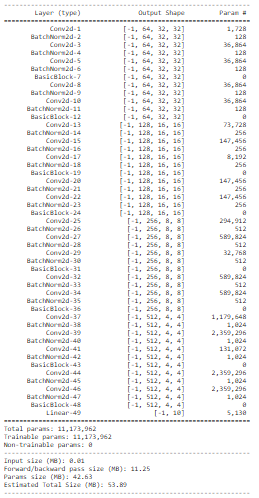

<h1 align = "center">Receptive Field and Network Architecture</h1>

<h2 align = "center">Assignment</h2>

1. Go through this repository: https://github.com/kuangliu/pytorch-cifar
2. Extract the ResNet18 model from this repository and add it to your API/repo. 
3. Use your data loader, model loading, train, and test code to train ResNet18 on Cifar10
4. Your Target is 85% accuracy. No limit on the number of epochs. Use default ResNet18 code (so params are fixed). 
5. Once done finish S8-Assignment-Solution. 

<h2 align = "center">Solution and Results</h2>

Here we are asked to import resent in our library [PyDeNN](https://github.com/KillerStrike17/PyDeNN)

We have not just added ResNet but also all the other networks i.e.
* DenseNet
* Dpn
* EfficientNet
* GoogleNet
* LeNet
* MobileNet
* Pnasnet
* Preact_resnet
* Regnet
* ResNet
* ResNext
* Senet
* ShuffleNet_v2
* vgg

The Models can be found [here](https://github.com/KillerStrike17/PyDeNN/tree/master/DeNN/model).

### Model Architecture

<div align="center">
  <center>
    
  </center>
</div>

**Results:** 
    
    Reached 85 % test accuracy in 20 Epochs
    ```Train Accuracy : 92.46%```
    ``` Test Accuracy: 87.18% ```
    ```Total Parameters: 11,173,962```

---
<h3 align = "center"> Made with ❤ & 🍻 by KillerStrike</h3>
