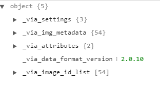

<h1 align = "center">JSON Details</h1>

<h2 align = "center">Structure</h2>

---

  

    
  

---

<h2 align = "center">Structure Breakdown</h2>

---

<h3 align = "center">_via_settings</h3>

Via settings has 3 subtypes i.e. ui, core & project.

* ui contains information of annotation editor UI i.e. edditor hieght, font size, sidebar width, Image grid containing the information of the bounding box and the text of the bounding box.

* core contains the informaton of buffer size, file path and default filepath.
* project contains the project name.
  
<h3 align = "center">_via_img_metadeta</h3>

_via_img_metadeta has 54 subtypes.

These subtypes are folders for each images. Each folder contains the following informations:

* filename: name of the image
* size: image size
* regions: storing the annotation information
  * Each region has a subtype contain each annotion
  * each annotation has shape and region attribute
  * Shape attribute contains the information of the bounding box i.e. name: rectangle, x and y coordinate and height and width of the box
  * Region attribute contains the class information i.e. which class is the annotation for.

<h3 align = "center">_via_attributes</h3>

_via_attributes has 2 subtypes i.e. regions and file

* Regions: It contains the details of the classes. There is a class segment in it. class has 4 subtypes i.e. type, description, options and default value.
  * type is dropdown
  * description is value type
  * options contain all the four classes i.e. hardhat, vest, mask and boots.
  * default value is the value which will be selected while drawing bounding box. It is set as vest, so if any class is not specified, the bounding box will be specified as vest.

<h3 align = "center">_via_data_format_version</h3>

This contains the version of the vgg annotator which is 2.0.10.

<h3 align = "center">_via_image_id_list</h3>

It contains 54 elements. It is basically a list of all the images.

---

<h3 align = "center"> Made with ❤ & 🍻 by KillerStrike</h3>