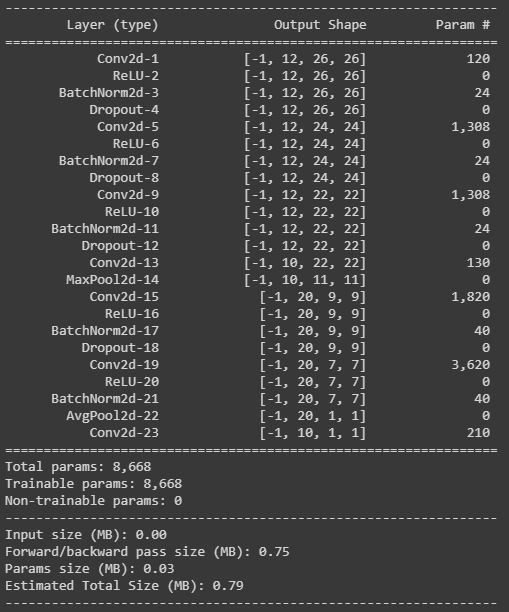

<h1 align="center">Architecture Basics</h1>

<h2 align="center">Question</h2>

We have considered many many points in our last 4 lectures. Some of these we have covered directly and some indirectly. They are:
* How many layers,
* MaxPooling,
* 1x1 Convolutions,
* 3x3 Convolutions,
* Receptive Field,
* SoftMax,
* Learning Rate,
* Kernels and how do we decide the number of kernels?
* Batch Normalization,
* Image Normalization,
* Position of MaxPooling,
* Concept of Transition Layers,
* Position of Transition Layer,
* DropOut
 * When do we introduce DropOut, or when do we know we have some overfitting
* The distance of MaxPooling from Prediction,
* The distance of Batch Normalization from Prediction,
* When do we stop convolutions and go ahead with a larger kernel or some other alternative (which we have not yet covered)
* How do we know our network is not going well, comparatively, very early
* Batch Size, and effects of batch size
* etc (you can add more if we missed it here)

Refer to this code: [COLAB](https://colab.research.google.com/drive/1uJZvJdi5VprOQHROtJIHy0mnY2afjNlx)

WRITE IT AGAIN SUCH THAT IT ACHIEVES:
* 99.4% validation accuracy
* Less than 20k Parameters
* You can use anything from above you want. 
* Less than 20 Epochs
* No fully connected layer
* To learn how to add different things we covered in this session, you can refer to this code: [Kaggle](https://www.kaggle.com/enwei26/mnist-digits-pytorch-cnn-99) DONT COPY ARCHITECTURE, JUST LEARN HOW TO INTEGRATE THINGS LIKE DROPOUT, BATCHNORM, ETC.

**Note:**
This is a slightly time-consuming assignment, please make sure you start early. You are going to spend a lot of effort into running the programs multiple times
Once you are done, submit your results in S4-Assignment-Solution
You must upload your assignment to a public GitHub Repository. Create a folder called S4 in it, and add your iPynb code in it. THE LOGS MUST BE VISIBLE. Before adding the link to the submission make sure you have opened the file in an "incognito" window. 
If you misrepresent your answers, you will be awarded -100% of the score.
If you submit Colab Link instead of notebook uploaded on GitHub, or redirect the GitHub page to colab, you will be awarded -50%
This assignment is worth 300pts

<h2 align="center">Solution and Results</h2>

I developed two Architecture, the first one was very amibitious, I wanted to develop an architecture which could reach 99.4 % accuracy in **less than 10k Parameters without LR Scheduling and Image Augmentation**, I developed a decent model but it it was not able to cross 99.1, On doing some analysis I found out that my receptive field was less, it was 18x18 and had to be increased and also my training accuracy was not crossing 99.4 so the model parameters were also to be increased. This is when model 2 emerged.

## Model 1

### Architecture

