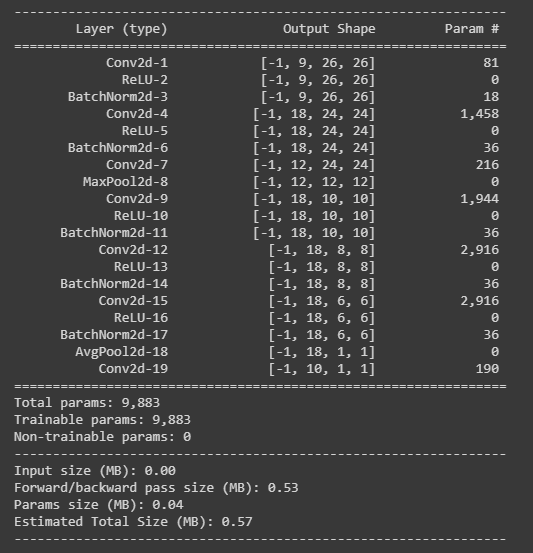
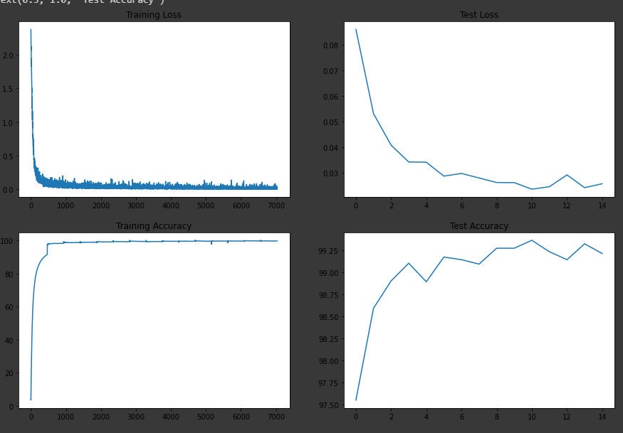
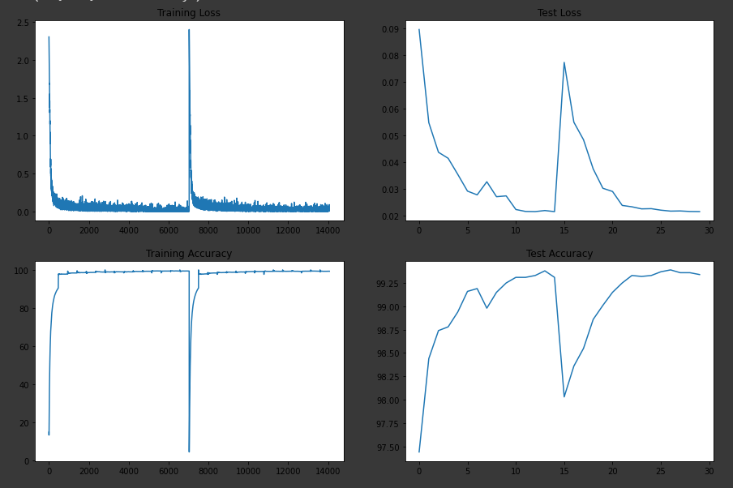

<h1 align = "center">Code Drill</h1>

<h2 align = "center">Assignment</h2>

1. Your target is: (over Mnist Dataset)
   1. 99.4% (this must be consistently shown in your last few epochs, and not a one-time achievement)
   2. Less than or equal to 15 Epochs
   3. Less than 10000 Parameters (additional points for doing this in less than 8000 pts)
2. Do this in exactly 4 steps
3. Each File must have "target, result, analysis" TEXT block (either at the start or the end)
4. You must convince why have you decided that your target should be what you have decided it to be, and your analysis MUST be correct. 
5. Evaluation is highly subjective, and if you target anything out of the order, marks will be deducted. 
6. Explain your 4 steps using these target, results, and analysis with links to your GitHub files (Colab files moved to GitHub).
7. Keep Receptive field calculations handy for each of your models. 
8. If your GitHub folder structure or file_names are messy, -100. 
9. When ready, attempt S5-Assignment Solution

In the quiz you are asked to type your answers for a question like this:

For your first attempt, please share your:

1. Targets:
2. Results: (must include best train/test accuracies and total parameters)
3. Analysis:
4. File Link:

<h2 align = "center">Solution and Results</h2>

Here I aimed to reach at 99.4% accuracy in less than 15 epochs under 8k parameters (One should always aim big). To do so I divided the problem in 4 versions, where each version gets better and better.

**Note:** Receptive Fields for All models is same as there is no structural change, only channel values are being changes. It is calculated and added in the end of the documentation.

### Version 1:

This version was designed to develop a basic structure of the final model, here the target was not to reach the benchmark given in the assignment, it was more on a decent architecture that gives decent accuracy. 

**Target:** Reach 99% accuracy in less than 150k parameters

**Model Architechture:**

<div align="center">
  <center>
    
  </center>
</div>

**Results:** 
    
    ```Train Accuracy : 99.96%```
    ``` Test Accuracy: 99.47% ```
    ```Total Parameters: 1,04,762```

<div align="center">
  <center>
    
  </center>
</div>

This Image represents the curve between the train/ test accuracy as loss. Here we can see that as we train more, the loss decreases and the accuracy increases. 

**Analysis:**

    1. Convolution Kernels:
        Here I used kernel of 3x3, because 
        1. they are accelerated by hardware, 
        2. they enables us to reach desired receptive field in less parameters, 
        3. they help us attain axis of symmetry. 
    2. 1x1 Kernels: 
       1. Reduces Dimensions as filters out channel values
       2. Which intern reduces computational load
       3. Allows us to go deep
    3. Max Pooling:
       1. Gives more translation, Rotational and Scaling invariances as compared to Comnvolution
       2. Doubles receptive field
       3. Faster computation as compared to Convolution layer
    4. Batch Normalization:
       1. Removed internal Covariate shift
       2. Faster Convergence
    5. Global Average Pooling: 
        We have used GAP in the end because
        1.  It helps us in reducing the total trainable parameters as if GAP wasnt therit coult a Conv layer or a dense layer
        2.  As the parameters are reduced, the chances of Over fitting also reduced. 

**Observation:**

1. The Model Architecture is big as compared to Target paramter
2. Model crosses the Benchmark Accuracy, far ahead of our target
3. The Model Overfits as we see the difference between train and test accuracy.

### Version 2:

Based on the observation in version 1, We decided to reduce the number of parameters to under 10k and try to get the target accuracy or alteast an accuracy close to that.

**Target:** Reach 99.4% or close accuracy in less than 10k parameters

<div align="center">
  <center>
    
  </center>
</div>

**Results:** 
    
    ```Train Accuracy : 99.60%```
    ``` Test Accuracy: 99.36% ```
    ```Total Parameters: 9,883```

<div align="center">
  <center>
    
  </center>
</div>

This Image represents the curve between the train/ test accuracy as loss. Here we can see that as we train more, the loss decreases and the accuracy increases. 

**Analysis:**

    1. Here we didnt alter anything much because here wanted to get the same kind of output as we got in the pervious version
    2. Some Stratergies Common in both version:
       1. Structure of the model follows a pattern i.e. S,L,M,L,L,L.
       2. Here S stands for small, L stands for Large, M stands for Medium. 
       3. GAP is used as Kernel size of 7x7.
       4. Max Pooling is used at Receptive Field of 5x5.

**Observation:**

1. The Model Architecture has cleared out test that it should be within 10k 
2. Model didnot crosses the Benchmark Accuracy as the best test accuracy was 99.36%
3. The Model Overfits as we see the difference between train and test accuracy.

### Version 3:

Based on the observation in version 2, We decided to reduce the overfitting of the model to achieve the target accuracy.

**Target:** Reach 99.4% accuracy in less than 10k parameters under 15 Epochs

<div align="center">
  <center>
    
  </center>
</div>

**Results:** 

    Model 1: 

    ```Train Accuracy : 99.55%```
    ``` Test Accuracy: 99.47% ```
    ```Total Parameters: 9,883```

With Step size as 6
<div align="center">
  <center>
    
  </center>
</div>

    Model 2: 

    ```Train Accuracy : 99.66%```
    ``` Test Accuracy: 99.38% ```
    ```Total Parameters: 9,602```

With Step size as 10
<div align="center">
  <center>
    
  </center>
</div>

    Model 3: 

    ```Train Accuracy : 99.58%```
    ``` Test Accuracy: 99.41% ```
    ```Total Parameters: 9,602```

With Step size as 10
<div align="center">
  <center>
    
  </center>
</div>

This Image represents the curve between the train/ test accuracy as loss. Here we can see that as we train more, the loss decreases and the accuracy increases. Model 1 & 3 crosses our target accuracy. 
The sudden spike in this graph is due to change in accuracy which somewhat changes the accuracy and loss for that epoch.
Its analysis is discussed below 

**Analysis:**

    1. Image Augmentation
       1. Image Augmentation enables the model to be robust
       2. Very helpful in less dataset
    2. LR Scheduling
       1. Helps in faster convergence
       2. Helps in reaching close to global minima rather than getting stuck at local minima
    3. Dropout Layer
       1. Forces all the neurons to perform its best
       2. Works on Ensembling model
   

**Observation:**

1. The Model Architecture has cleared out test that it should cross 99.4% accracy in less than 10k paramters in less than 15 epochs
2. LR Scheduler used is StepLR with a step size of 10,8 and 6
3. Step size of 10 enables us to reach desired accuracy.
4. Dropout used is 0.0
5. Random Rotation is usewith range -5,5 with fill value 0
6. We still not reach the ultimate goal to do it under 8k


### Version 4:

Based on the observation in version 3, We decided to reduce the parameter to 8k with maintaining the accuracy.

**Target:** Reach 99.4% accuracy in less than 8k parameters under 15 Epochs

<div align="center">
  <center>
    
  </center>
</div>

**Results:** 

    Model 1: 

    ```Train Accuracy : 99.42%```
    ``` Test Accuracy: 99.38% ```
    ```Total Parameters:7,911```

**We are close**


With Step size as 10
<div align="center">
  <center>
    
  </center>
</div>

    Model 2: 

    ```Train Accuracy : 99.31%```
    ``` Test Accuracy: 99.39% ```
    ```Total Parameters: 7,911```

**One should never give up..!!! Perseverance is the key to success.. we will try again..!!**

With Step size as 6
<div align="center">
  <center>
    
  </center>
</div>

    Model 3: 

    ```Train Accuracy : 99.43%```
    ``` Test Accuracy: 99.42% ```
    ```Total Parameters:7,911```

**Hurrah..!! The ultimate goal of this assignment is achieved.**

With Step size as 8

<div align="center">
  <center>
    
  </center>
</div>

This Images represents the curve between the train/ test accuracy as loss. Here we can see that as we train more, the loss decreases and the accuracy increases. 

**Analysis:**

    1. Here we reduced the parameters to fall in the total parameter range of less than 8k
    2. Stratergies followed:
       1. Structure of the model follows a pattern i.e. S,L,M,XL,XL,XL.
       2. Here S stands for small, L stands for Large, M stands for Medium and XL stands for Xtra Large. 
       3. Dropout used is 0
       4. Random Rotation is usewith range -5,5 with fill value 0

**Observation:**

1. The Model Architecture has cleared our ultimate goal
2. We have used step size of 6, 8, 10
3. Target Accuracy is achieved in step size 8.
   
### Receptive Field Calculation:

The link will direct you to the excel sheet where Receptive Field is calculated. Here the structure of the model is same so the receptive field for all models is same.

<div align="center">
  <center>
    
  </center>
</div>

Here Receptive Field of the model is same to the object and as it mnist we are okay with that.

[Excel Sheet](https://docs.google.com/spreadsheets/d/1bKrh3ggMtsCdBZY3utMckJnSM0hB0BmFIbtDAVVEifo/edit?usp=sharing)

**Final Observations:**

We have observed that it is good to break down problem is smaller problems and then tackle it individually. Here we achieved our ultimate goal by first making a draft model to get a decent accuracy, then upgraded that model to perform similar in less than 10 k parameters, Then upgraded that model to cross 99.4% accuracy and then upgraded that model to attain that accuracy in less than 8k paramters> As the problem increases we used more powerful tools liek image augmentation, dropout and LR scheduling. We fine tuned them to get the best of out it. 

---

<h3 align = "center"> Made with ❤ & 🍻 by KillerStrike</h3>