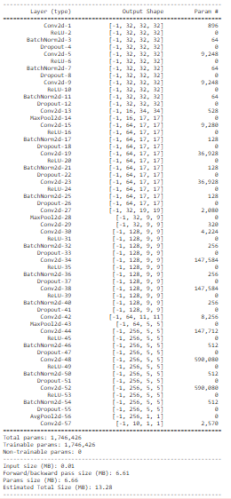
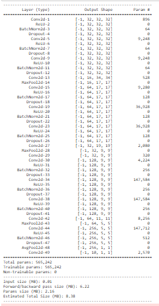

<h1 align = "center">Advance Architecture</h1>

<h2 align = "center">Assignment</h2>

1. Run this [network](https://colab.research.google.com/drive/1qlewMtxcAJT6fIJdmMh8pSf2e-dh51Rw).  
2. Fix the network above:
    1. change the code such that it uses GPU
    2. change the architecture to C1C2C3C40 (basically 3 MPs)
    3. total RF must be more than 44
    4. one of the layers must use Depthwise Separable Convolution
    5. one of the layers must use Dilated Convolution
    6. use GAP (compulsory):- add FC after GAP to target #of classes (optional)
    7. achieve 80% accuracy, as many epochs as you want. Total Params to be less than 1M. 
    8. upload to Github
    9. Attempt S7-Assignment Solution

<h2 align = "center">Solution and Results</h2>

Here we are asked to import a custom model following the architecture listed in 2.2. It can be found here in our library [PyDeNN](https://github.com/KillerStrike17/PyDeNN/tree/master/DeNN/custom_model)

### Model Architecture

**Version 1** : More then 1M parameters
<div align="center">
  <center>
    
  </center>
</div>

**Version 2:** Less then 1M parameters

<div align="center">
  <center>
    
  </center>
</div>

### Result:

**Version 1:**
    Reached 80 % test accuracy in 37 Epochs
    
    ```Train Accuracy : 84.48%```
    
    ``` Test Accuracy: 83.29% ```
    
    ```Total Parameters: 1,746,426```

**Version 2:**
    
    Reached 80 % test accuracy in 40 Epochs
    
    ```Train Accuracy : 88.14%```
    
    ``` Test Accuracy: 84.89% ```
    
    ```Total Parameters: 565,242```

### Receptive Field Calculation

[Link](https://docs.google.com/spreadsheets/d/132uhX869gU084JL_zYU6AI3RujHry950EqmBB9dpp0I/edit?usp=sharing)

Receptive Field for Version 2

<div align="center">
  <center>
    
  </center>
</div>

Here we have receptive field of 98 which is more than the asked Receptive Field.

---
<h3 align = "center"> Made with ❤ & 🍻 by KillerStrike</h3>